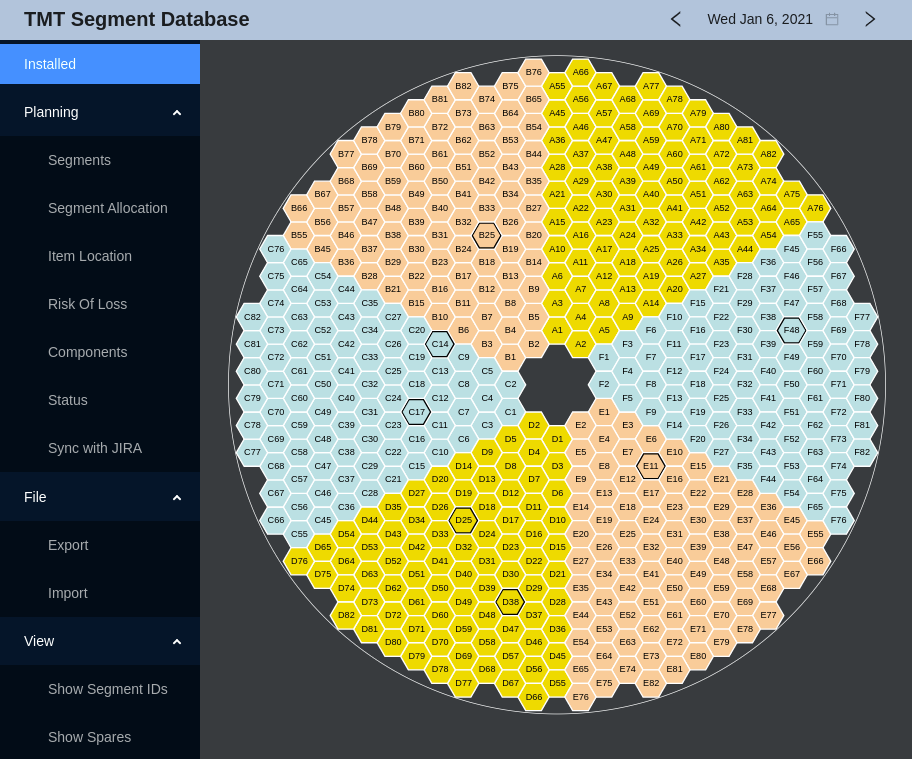

# ESW Segment DB Prototype

This project contains a server, command line client and web app for keeping track of TMT mirror segments.

The server uses Postgres to manage the data and makes use of the CSW Database Service.
It provides an HTTP API, by default on port 9192. You can use the `--port` option to override this.

The command line client makes use the the HTTP service to provide some access via the command line.

The web app uses the HTTP server and displays the mirror sectors and segments. 
Clicking on a segment displays the details and allows you to change the Segment-ID for the selected position. 

## Initializing the Database

Assuming you have Postgres installed and setup, and the `psql` command in your path:
Run [scripts/init-db.sh](scripts/init-db.sh) to create the database and tables.
This creates the tables for production and separate ones used for testing.

## Building the Server

To build the server, run:

    sbt stage

## Running the Server

To run the HTTP server, you need to first have csw-services running, 
as described in the [CSW docs](https://tmtsoftware.github.io/csw/).

The following environment variables need to be defined (Required by csw-services for the Database Service):

* DB_READ_USERNAME
* DB_READ_PASSWORD
* DB_WRITE_USERNAME
* DB_WRITE_PASSWORD
* PGDATA

PGDATA is the directory containing the data for the Postgres database.

In addition, in order for the server to update information about the segments from JIRA (via the 
"Sync with JIRA" item in the web app), the 
following environment variables need to be defined and the user must have read access to the `M1ST` JIRA project:

* JIRA_USER
* JIRA_API_TOKEN

The basic JIRA information is included by default.

See [here](https://developer.atlassian.com/cloud/jira/platform/basic-auth-for-rest-apis/) for more information.

To start the server, run:

```
$ csw-services start
$ ./target/universal/stage/bin/esw-segment-db
...
Server online at http://0:0:0:0:0:0:0:0:9192
For HTTP API docs see: http://localhost:9192/docs
```

The --help option displays the command line options:

```
Usage: esw-segment-db [options]

  --port <number>  The port number to use for the server (default: 9192)
  -t, --testMode   Use a test database instead of the normal one
```

Interactive HTTP API documentation is available under 
[http://localhost:9192/docs](http://localhost:9192/docs).

## Authentication

To run the server and web app with CSW/Keycloak based authentication turned on, 
set the `auth-config.disabled` property to false in application.conf or on the command line:

```
  esw-segment-db -Dauth-config.disabled=false
```

When not disabled, the web app will display a Login button and features that modify the
database will be disabled unless the user is logged in. The default credentials for
development mode are currently: user: `config-admin1`, password: `config-admin1` (role: `config-admin`).

## Running the command line client

The command line client requires the server to be running.
Then:
```
$ ./target/universal/stage/bin/esw-segment-db ...
```

The --help option displays the commmand line options:

```
Usage: esw-segment-db-client [options]

  --host <hostname>        The host name where the ESW Segment DB HTTP server is running (default: localhost)
  --port <number>          The port number to use for the server (default: 9192)
  --date yyyy-MM-dd        The date to use (default: current date)
  --from yyyy-MM-dd        The starting date to use for a date range (default: current date)
  --to yyyy-MM-dd          The ending date to use for a date range (default: current date)
  -s, --segmentId <id>     The segment id to use
  -p, --position <A1 to F82>
                           The segment position to use (A1 to F82)
  --setPosition            Sets or updates the date and position of the given segment (Requires --position, --segmentId if segment is present)
  --segmentPositions       Gets a list of segments positions for the given segment id in the given date range (Requires --segmentId)
  --segmentIds             Gets a list of segment ids that were in the given position in the given date range (Requires --position)
  --newlyInstalledSegments
                           Gets a list of segments that were installed since the given date (Requires --date)
  --currentPositions       Gets the current segment positions, sorted by position
  --currentSegmentPosition
                           Gets the current segment position for the given segment id (Requires --segmentId)
  --currentSegmentAtPosition
                           Gets the id of the segment currently in the given position (Requires --position)
  --positionsOnDate        Gets the segment positions as they were on the given date, sorted by position
  --mostRecentChange       Gets the most recent date that segments were changed
  --segmentPositionOnDate  Gets the segment position for the given segment id on the given date (Requires --segmentId)
  --segmentAtPositionOnDate
                           Gets the id of the segment that was installed in the given position on the given date (Requires --position)
  --resetTables            Drops and recreates the database tables (for testing)
```

 ## Running the Web App Server
 
 The web app requires npm. It may be necessary to run:
 
    $ cd ./esw-segment-web
    $ npm install

once. Then to start the web app server for development: 
 
    $ npm start

This automatically opens the browser to [http://localhost:8080/](http://localhost:8080/).



# Deploying the Web App

Note: For remote use, you will need to edit [SegmentData.tsx](esw-segment-web/src/components/SegmentData.tsx) and change
the value of `baseUri` to where `esw-segment-db` is running. 
Since there are two servers (esw-segment-db and the react web app), this is currently how the companion server is located.

Then run:
    
    npm run build
    serve -s build -l 8080

Use the `-l` option to change the port the app will run on.
 

