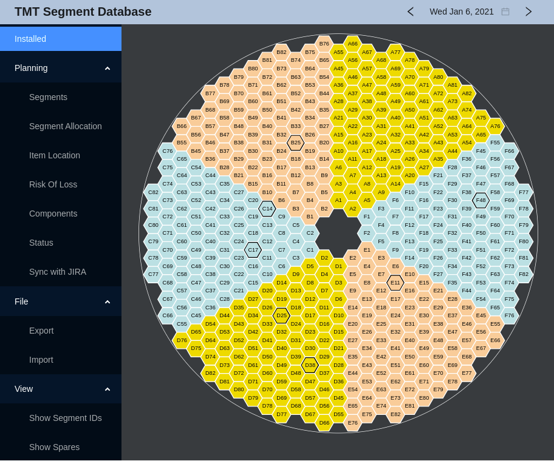

# esw-segment-web
This subproject contains the React/Typescript based ESW Segment DB web application.
This version runs outside the browser as an [Electron app](https://www.electronjs.org/).



The "Installed" view shows the sectors of the TMT mirror with their positions (A1 to F82).
Optionally, you can view the segment ids instead. The outlined segments are the
ones that changed most recently. Using the arrow buttons in the tool bar you can
go back and forth in time to see the previous configurations of the mirror.

On the left are some controls that let you view various information gathered from the
JIRA tasks that are used to manage segment information.
Updating the JIRA information (via the "Sync with JIRA" item) requires a valid JIRA token.

## Prerequisites Required for Running App

* The latest version of [Node.js](https://nodejs.org/en/download/package-manager/) must be installed.
* csw-services should be running (including the Database Service)
* The esw-segment-db server must be running

## Run the App in Local Environment

(Note: `npm` or `yarn` can be used in the following commands, but should not be mixed.)

Run following commands in the terminal.
```
npm install
npm run dev
```

This should open the application in a dedicated window.

## Build the App for Production

Run following commands in the terminal:
```
npm install
npm run release
```

The release files are then found under ./dist (`snap` for Linux, `dmg` for MacOS).
Note that you can only build a release for the OS that you are building on.

## References
- ESW-TS Library - [Link](https://tmtsoftware/esw-ts/)
- ESW-TS Library Documentation - [Link](https://tmtsoftware.github.io/esw-ts/)
